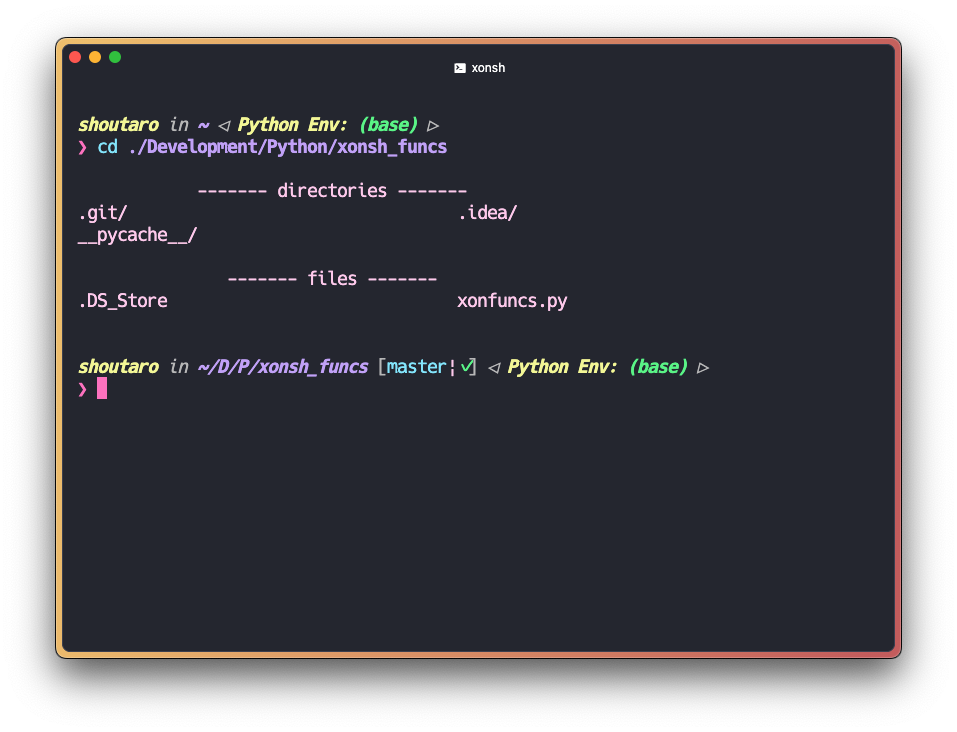

# Change Directory AND LiSt all components

**cd** (ディレクトリを移動) した時に **ls -a** (移動先のディレクトリ名・ファイル名を全て表示) してくれる [xonsh](https://xon.sh) 用の関数を作成しました。  


## Requirements
- Python>=3.8
- xonsh>=0.11.0

## Install
以下のコマンドでこのリポジトリをクローンしてください。

```
git clone "https://github.com/shoutar0m/cd-and-ls"
```

## Usage
1.  `.xonshrc` を適切なディレクトリに作成してください。
2.  以下のコードや `.xonshrc_example` を参考に、`CdAndLs` クラスの `main()` メソッドを呼び出すコードとエイリアスを追記してください。

```.xonshrc
import sys
sys.path.append('path/to/myfunc.py')
	
from myfunc import CdAndLs
	
# 自作関数の定義
def cd_and_ls(arg):
	
    ︙
	
    func = CdAndLs()
    func.main(path)
	
    ︙
	
	
# エイリアスの作成
aliases['cd'] = cd_and_ls
```
3. ターミナルアプリを起動し、以下のように `cd` コマンドをご使用ください。

```
cd Development/Python/xonsh_func  # Example
```

## Note
38文字を超えるディレクトリ名・ファイル名の表示に対応できていません。  
今後修正していく予定です... 。  
文字列に日本語が含まれるかの判断は、[こちら](https://minus9d.hatenablog.com/entry/2015/07/16/231608) のサイトを参考にさせていただきました。
